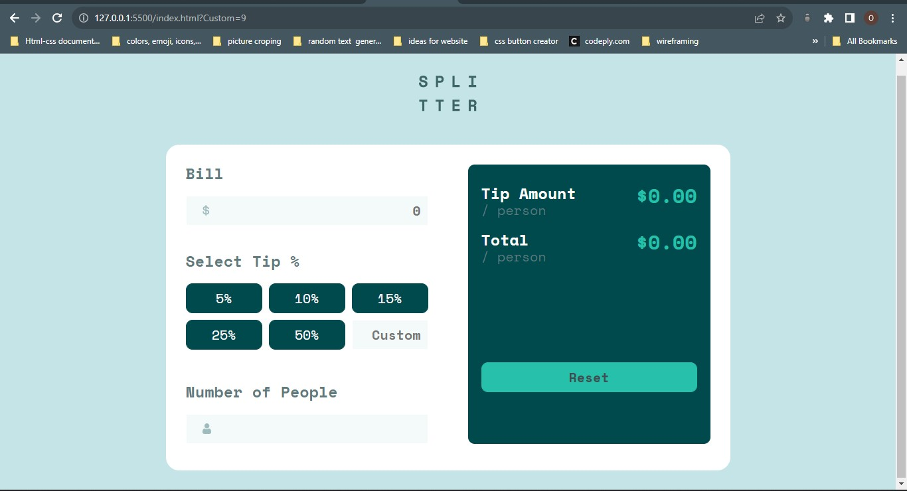
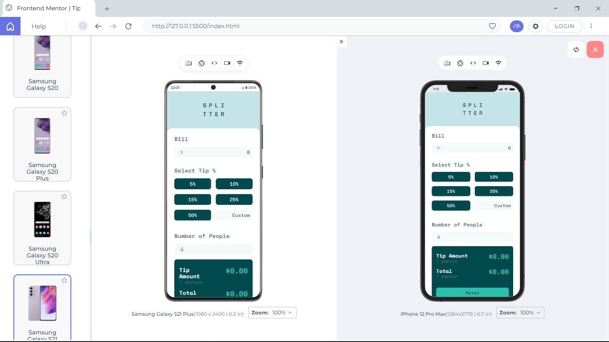

# Frontend Mentor - Tip calculator app solution

This is a solution to the [Tip calculator app challenge on Frontend Mentor](https://www.frontendmentor.io/challenges/tip-calculator-app-ugJNGbJUX). Frontend Mentor challenges help you improve your coding skills by building realistic projects.

## Table of contents

- [Overview](#overview)
  - [The challenge](#the-challenge)
  - [Screenshot](#screenshot)
  - [Links](#links)
- [My process](#my-process)
  - [Built with](#built-with)
  - [What I learned](#what-i-learned)
  - [Continued development](#continued-development)
  - [Useful resources](#useful-resources)
- [Author](#author)
- [Acknowledgments](#acknowledgments)

## Overview

### The challenge

Users should be able to:

- View the optimal layout for the app depending on their device's screen size
- See hover states for all interactive elements on the page
- Calculate the correct tip and total cost of the bill per person

### Screenshot

### Links

- Solution URL: [Add solution URL here](https://your-solution-url.com)
- Live Site URL: [Add live site URL here](https://your-live-site-url.com)

## My process

### Built with

- Semantic HTML5 markup
- CSS custom properties
- Flexbox
- CSS Grid
- Mobile-first workflow
- Javascript

### What I learned

During the working on this project, i learnt more about creating reuseable functions in javascript. i also learnt about planning my code and also think of possible errors which may align from the way the user use the web application and i also solved all this problems. During the course of working on this, i learnt about the input event listener and i was able to apply it where necessary. i also learnt more about calling a function multiple times in different location and also more about how this works and more insight on when to do it.

### Continued development

### Useful resources

## Author

- Github - [Olaoye Praise](https://github.com/Praixx)
- Email - [Olaoye Praise](praix1y@gmail.com)
- Twitter - [@Praixx_](https://www.twitter.com/Praixx_)

## Acknowledgments

